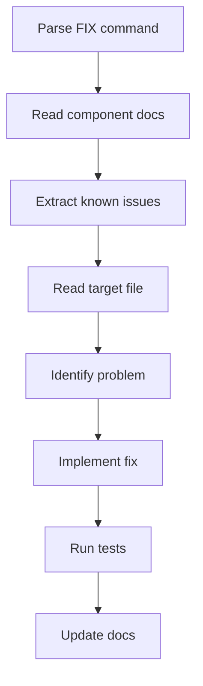
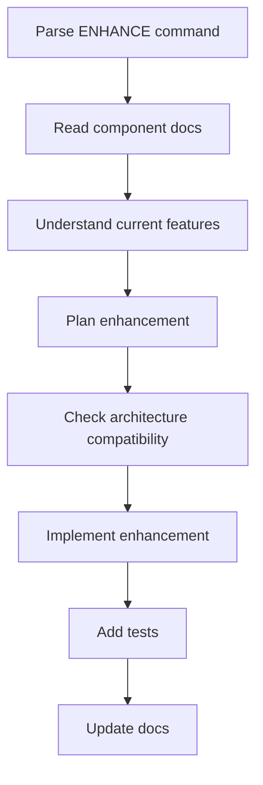
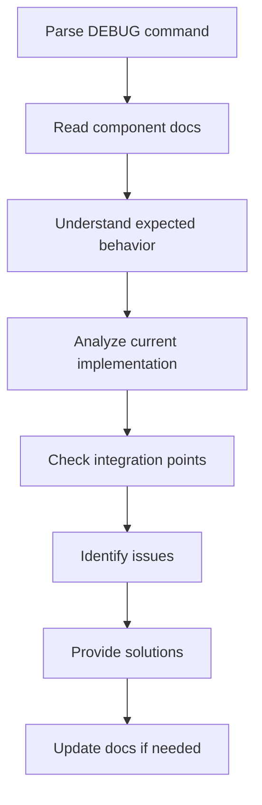

# 🎯 Focused Command Processor

**Purpose**: Standardized workflow for processing focused development commands  
**Version**: 1.3.0  
**Created**: 2025-06-27

## 🔄 Command Processing Workflow

When a user gives a focused command (e.g., "FIX PAGE LoginView"), follow this workflow:

### **Step 1: Parse Command** 📥
Extract command components:
```
Pattern: [ACTION] [TYPE] [TARGET] [optional: specific area]

Examples:
- "FIX PAGE LoginView" → Action: FIX, Type: PAGE, Target: LoginView
- "ENHANCE COMPONENT RecipeCard favoriting" → Action: ENHANCE, Type: COMPONENT, Target: RecipeCard, Area: favoriting
- "DEBUG ENDPOINT /api/v1/auth/login" → Action: DEBUG, Type: ENDPOINT, Target: auth/login
```

### **Step 2: Locate Documentation** 📋
Based on TYPE, determine documentation path:

```typescript
const docPaths = {
  PAGE: `docs/frontend/pages/${target}.md`,
  COMPONENT: `docs/frontend/components/${target}.md`, 
  FEATURE: `docs/frontend/features/${target}/README.md`,
  ENDPOINT: `docs/backend/endpoints/${parsePath(target)}.md`,
  SERVICE: `docs/backend/services/${target}.md`,
  MODEL: `docs/backend/models/${target}.md`,
  MIDDLEWARE: `docs/backend/middleware/${target}.md`
};
```

### **Step 3: Extract Metadata** 🔍
Read the documentation and extract:
- **File Location**: Exact path to the target file
- **Dependencies**: Required services, components, stores
- **Current Features**: What it currently does
- **Known Issues**: Existing problems to be aware of
- **Testing Info**: Related test files and coverage
- **Version History**: For rollback compatibility
- **Related Components**: Integration points

### **Step 4: Read Target Files** 📖
Based on metadata, read:
- **Primary file**: The main target file
- **Dependency files**: Key dependencies if needed for context
- **Test files**: Related test files for understanding expected behavior

### **Step 5: Execute Action** ⚡
Based on ACTION type:

#### **FIX Actions**
1. Identify the specific issue (from known issues or user description)
2. Understand current implementation
3. Locate the problem in the code
4. Implement targeted fix
5. Update tests if needed
6. Update documentation known issues

#### **ENHANCE Actions**
1. Understand current capabilities
2. Plan enhancement within existing architecture
3. Implement new functionality
4. Add/update tests for new features
5. Update documentation features list

#### **UPDATE Actions**
1. Understand current implementation
2. Plan backward-compatible changes
3. Implement updates preserving existing functionality
4. Update tests to match new behavior
5. Update documentation and version tracking

#### **DEBUG Actions**
1. Analyze current implementation
2. Check recent changes and related components
3. Identify potential issues or root causes
4. Provide debugging steps and recommendations
5. Implement fixes if issues found

### **Step 6: Update Documentation** 📝
Always update the component documentation:
- **Version increment** if significant changes
- **Known issues** if new problems discovered
- **Features list** if functionality added
- **Future enhancements** based on user feedback
- **Related components** if new dependencies added

## 🎯 Action-Specific Workflows

### **FIX Workflow**


**Key Focus**: Solve specific problems without breaking existing functionality

### **ENHANCE Workflow**


**Key Focus**: Add value while maintaining existing patterns

### **DEBUG Workflow**


**Key Focus**: Investigate and provide actionable solutions

## 🔄 Example Command Processing

### Example: "FIX PAGE LoginView validation errors"

**Step 1: Parse**
- Action: FIX
- Type: PAGE  
- Target: LoginView
- Area: validation errors

**Step 2: Locate Documentation**
- Path: `docs/frontend/pages/LoginView.md`

**Step 3: Extract Metadata**
```yaml
file_location: frontend/src/views/LoginView.vue
dependencies: 
  - auth.service.ts
  - auth.store.ts
  - useAuth.ts
known_issues: "None currently identified"
tests: ui-tests/tests/auth/login.test.js
version: 1.3.0
```

**Step 4: Read Files**
- Read `frontend/src/views/LoginView.vue`
- Check `auth.service.ts` for validation logic
- Review test file for expected validation behavior

**Step 5: Execute FIX**
1. Identify validation error patterns
2. Check form validation implementation
3. Fix validation logic
4. Update tests if needed

**Step 6: Update Documentation**
- Mark validation issue as resolved
- Update features if validation improved
- Increment patch version if significant

## 🚀 Quick Reference Commands

### **Command Templates**
```bash
# Page Commands
FIX PAGE [PageName] [optional: specific issue]
ENHANCE PAGE [PageName] [optional: specific feature]
UPDATE PAGE [PageName] [optional: specific area]
DEBUG PAGE [PageName] [optional: specific problem]

# Component Commands  
FIX COMPONENT [ComponentName] [optional: specific issue]
ENHANCE COMPONENT [ComponentName] [optional: specific feature]
UPDATE COMPONENT [ComponentName] [optional: specific area]
DEBUG COMPONENT [ComponentName] [optional: specific problem]

# Feature Commands
FIX FEATURE [feature-name] [optional: specific area]
ENHANCE FEATURE [feature-name] [optional: specific capability]
UPDATE FEATURE [feature-name] [optional: specific system]
DEBUG FEATURE [feature-name] [optional: specific problem]

# Backend Commands
FIX ENDPOINT [/api/path] [optional: specific issue]
FIX SERVICE [service-name] [optional: specific method]
FIX MODEL [model-name] [optional: specific field]
ENHANCE SERVICE [service-name] [optional: specific capability]
DEBUG MIDDLEWARE [middleware-name] [optional: specific behavior]
```

### **Escalation Triggers**
Escalate to full systematic process when:
- Multiple components need modification
- Database schema changes required
- New API endpoints needed
- Breaking changes required
- Architecture modifications needed

**Escalation Command**: 
```
"This requires systematic process due to [reason]. Switching to INTAKE_PARSER workflow."
```

## 📋 Documentation Integration

### **Auto-Updates**
Focused commands automatically maintain:
- Component documentation accuracy
- Version tracking
- Known issues lists
- Feature inventories
- Integration mappings

### **Cross-References**
When modifying a component, check and update:
- Related component documentation
- Feature overview documents
- Integration documentation
- API documentation (if applicable)

---

**This processor enables efficient, targeted development while maintaining comprehensive documentation and architectural consistency.**